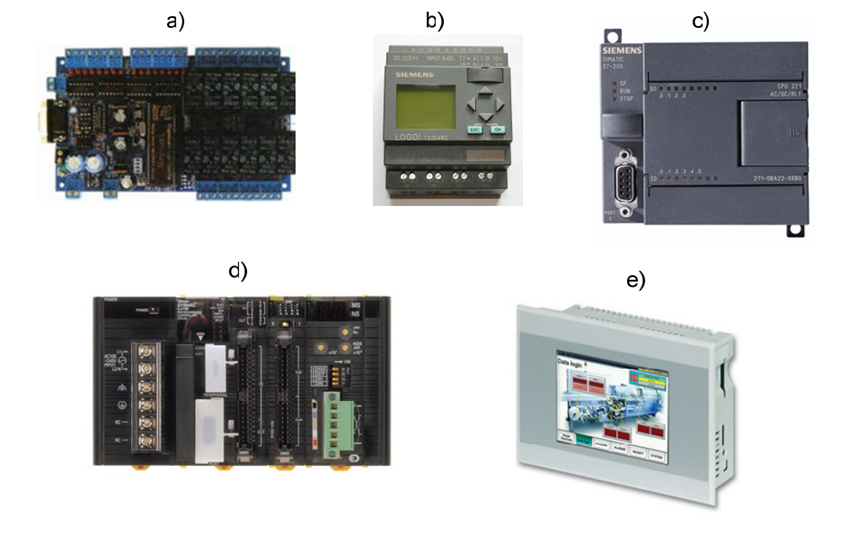

# Introduction

**Programmable Logic Controllers (PLCs)** are electronic devices widely used for controlling and monitoring industrial processes. PLCs are commonly employed in various industries such as industrial automation, manufacturing, energy, building automation, and more. They can range from small modular units with a few inputs and outputs to large cabinet-mounted systems with thousands of inputs and outputs. Often, they are networked with other PLCs, allowing the implementation of advanced control algorithms that can be easily modified and adapted.

The primary function of a PLC is to perform specific control tasks based on programs that are input into the controllers. These programs define sequences of logical instructions that govern the behavior of devices connected to the PLC. Examples of tasks that can be executed by PLCs include motor control, speed regulation, parameter monitoring, data collection, calculations, and many others.

## History

The first programmable logic controller appeared in **1968**. It was designed at **General Motors** to replace complex relay-based control systems.

Advantages of PLCs over relay-based control systems include:

- Modular construction, facilitating easy expansion and component replacement.
- Smaller physical size and greater reliability due to the use of digital electronics.
- Simplified regulation of machines and devices, as the program can be changed without physical alterations.
- Lower installation costs due to reduced wiring and components.
- During the 1970s, PLCs were primarily used in the automotive industry. However, they quickly gained popularity, and by the 1990s, they were widely used in all industrial sectors.

The **ladder diagram** programming language played a significant role in their popularity, as it intuitively mirrored control circuit diagrams. Since it is based on relay logic, it facilitated an easy transition for engineers who had previously designed systems exclusively based on relays. The fact that the ladder diagram language is graphical further aided in its adoption and learning.

## Architecture

A programmable logic controller is an industrial controller based on a microprocessor that includes programmable memory for storing program instructions and various functions.

It consists of:

- A processor (CPU) that processes inputs, executes the program stored in memory, and sends output signals.
- A power supply that converts AC power to DC power.
- Memory for storing data from inputs and the program to be executed by the processor.
- Input and output interfaces where the controller receives and sends data to/from external devices.
- A network interface for receiving and transmitting data on communication networks with remote PLCs.
Programmable logic controllers require a separate programming device used to create and upload programs to the controller's memory.

Modern programmable logic controllers often include their own operating systems, such as **OS-9** or **VxWorks**.

## Operation Principle

The operation is based on executing programs that specify actions to be taken in response to certain input signals.

- **Inputs**: The PLC receives input signals from various sources, such as sensors, switches, or other devices. These signals provide information about the state of machines, processes, or the operating environment.
- **Processing**: The PLC executes a predefined program that determines appropriate actions based on the input state. This program is typically created in a specialized PLC programming language, such as **ladder logic** or textual languages like **Structured Text** or **Function Block Diagram**.
- **Logic**: During program execution, the PLC uses various logical, mathematical, and control operations to determine the activation of specific output signals. For example, if a certain input exceeds a threshold value, the PLC may activate a specific output.
- **Outputs**: The PLC generates output signals that control actuators like motors, valves, or alarms. These actions aim to adjust the process or machine to the desired state or behavior.
- **Monitoring**: A programmable logic controller continuously reads input signals and performs operations based on these readings. It can also monitor various parameters and the status of equipment or processes, including error handling, diagnostics, and data logging.
**Scan Cycle**: PLCs operate in a scan cycle where the program loops continuously. In this process, the controller consistently reads input data, processes the program, generates output data, and starts again by re-reading input data.

## Classification of PLC Microprocessors

In the current industrial automation sector, numerous leading manufacturers offer programmable logic controllers with varying functional capabilities. To ensure compatibility between different models from the same manufacturer, the concept of PLC families has been adopted. This concept involves designing all models within a family with similar features, enabling better selection of hardware for the intended control system size. Individual PLC models within a family share common characteristics, including:

- Programming using the same software package in the same programming language.
- The same program variables and similar expansion module structures.
- Easy program transferability between models.
One criterion for classifying PLCs within a family is their size, often associated with the available memory and the number of supported inputs/outputs (I/O). Though there are no formal definitions that categorize a PLC model unequivocally, considering the size criterion, PLCs can be categorized as follows:

- **Small PLCs** – Supporting up to 128 I/O and with program memory up to 2KB.
- **Medium PLCs** – Supporting up to 512 I/O and with program memory up to 16KB.
- **Large PLCs** – Supporting up to 4096 I/O and with program memory up to 96KB.
These size categories were applicable in the 1990s. It's evident that, considering the dynamic development of electronics and technological advances in semiconductor manufacturing, modern PLCs have significantly more memory than the values mentioned above.

PLCs can also be classified based on their construction features, such as enclosure type or the ability to install additional expansion modules. In this context, you can encounter the following types:

- **Open-frame PLCs** – Used as embedded control systems, designed for installation inside machines and equipment.
- **Compact PLCs** – Simple construction with typically small dimensions, integrating the power supply, central processing unit, and I/O modules in a single enclosure.
- **Expandable compact PLCs** – Compact in design, allowing the installation of additional expansion modules.
- **Modular PLCs** – Most commonly found in medium and large PLCs. They feature a flexible design in which users can configure functionality by selecting appropriate modules, including central processing units, I/O modules, communication modules, and special-purpose modules. These modules are installed in special racks or panels.
- **Integrated HMI PLCs** – These PLCs are integrated into operator panels, with the central processing unit and communication interfaces usually located inside the panel enclosure. Connection terminals are typically located on the rear of the controller or in separate expansion modules.

## Primary Applications of PLC Microprocessors

1. **Automation of Production Processes**: PLCs are widely used in industry to automate production processes, increasing efficiency and product quality.
2. **Machine Control**: Microprocessor PLCs are used for controlling machinery in various industries, including food, automotive, pharmaceuticals, and more.
3. **HVAC Control Systems**: PLCs are employed to manage heating, ventilation, and air conditioning (HVAC) systems in commercial and industrial buildings.
4. **Security and Safety Systems**: PLCs are used for controlling alarm systems, monitoring, and access control in commercial and industrial facilities.
5. **Chemical Process Control**: In the chemical industry, PLCs help control and monitor chemical processes, ensuring safety and precision.
6. **Agricultural Automation**: PLCs are utilized for controlling agricultural machinery, irrigation, product sorting, and other agricultural tasks.
7. **Transportation and Logistics**: In warehouses and distribution centers, PLCs assist in managing sorting systems, conveyors, and storage.

## Examples of Well-Known PLC Manufacturers

1. **Siemens**: Offers a wide range of PLC controllers, including the SIMATIC S7 series, designed for various applications. Siemens also provides comprehensive industrial automation solutions, including software for PLC programming (LOGO! Software), user interfaces, operator panels, and process management solutions.

2. **Schneider Electric**: Offers Modicon PLC controllers, including the M340, M580, and others. The company also provides PLC programming software, supervisory control and data acquisition (SCADA) systems, and energy management solutions.

3. **Other Leading Manufacturers**: Other prominent PLC manufacturers include Allen-Bradley, Mitsubishi Electric, and ABB.

Please note that the information provided is a comprehensive summary of the original text.

### Sources

- [https://www.controleng.com/articles/future-of-the-plc/](https://www.controleng.com/articles/future-of-the-plc/)
- [https://dbc.wroc.pl/Content/7791/PDF/Pawlak_Sterowniki_programowalne.pdf](https://dbc.wroc.pl/Content/7791/PDF/Pawlak_Sterowniki_programowalne.pdf)
- [http://marcin.kielczewski.pracownik.put.poznan.pl/ZSP05.pdf](http://marcin.kielczewski.pracownik.put.poznan.pl/ZSP05.pdf)
