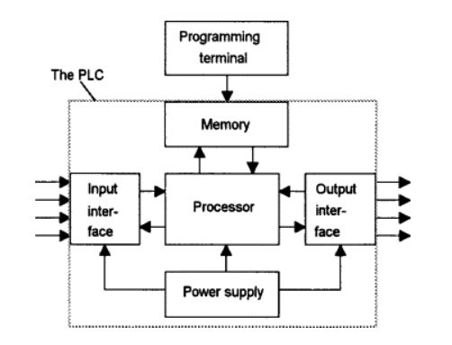
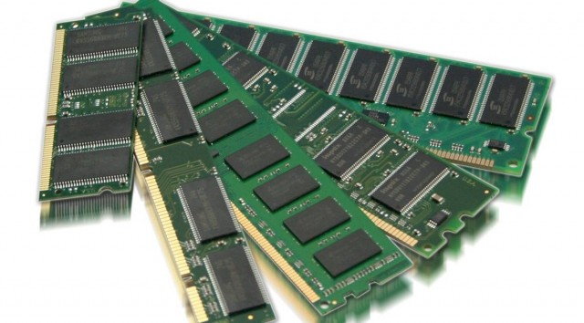
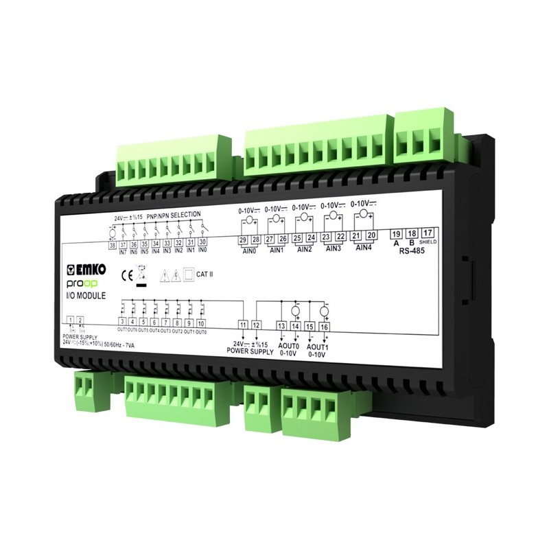
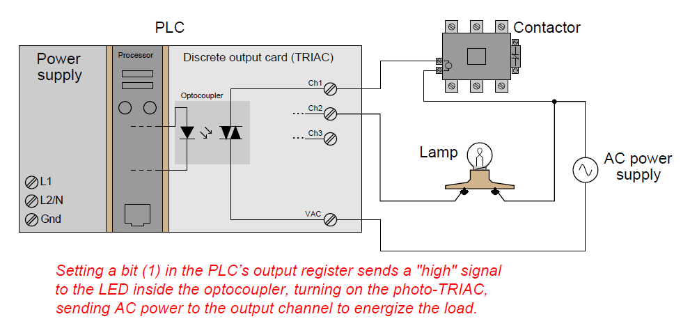
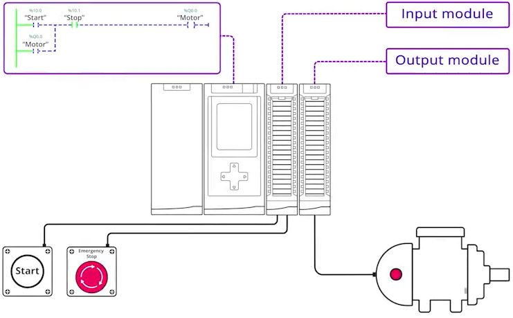
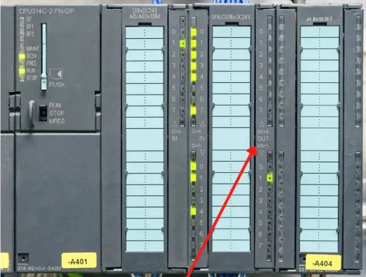
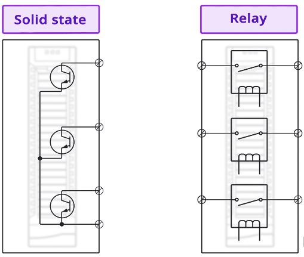
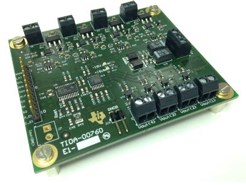

# 1. Internal structure of a Programmable Logic Controller

## What is a PLC?

A Programmable Logic Controller (PLC) is a small computing device that carry out pre-programmed outputs based on inputs and a set of specific logic rules. It is used for controlling and automating various processes and machinery in industries and manufacturing environments.

## How is a PLC built?

### 1. CPU

The central processing unit (CPU), also known as the processor unit, is responsible for interpreting input signals and executing control actions based on the program stored in its memory. It communicates decisions as action signals to the output devices. It can execute millions of instructions per second, but only one instruction at a time.

The CPU in the PLC follows a repeating cycle. This circuit is important for processing instructions and controlling the operation of the PLC:

- It retrieves instructions from memory (fetching) to know how to execute the input and understand the instructions corresponding to the specific information it receives. This is also called reading from memory.

- Decoding or translating the instructions into a machine language (binary), which CPU can understand.

- Executing the instructions given.

- Writing results to memory.

CPU consists of 3 main parts:
  
- ALU (Arithmetic and Logic Unit) is a component that performs arithmetic and numerical operations in every computer. ALU is used for addition, subtraction, division, division, comparison of two numbers, and Boolean operations. It does not directly deal with memory.
- CU (Control Unit). It controls the input and output flow. It is the part that receives instructions from the main memory, stores them, and then decodes them.
- Registers. Super fast memory location. The data and instructions being processed at runtime of cycle are stored there for quick access by the processor.

### 2. The memory unit

The memory unit stores the program that the microprocessor uses to control the system. The main types of memory used in PLCs are ROM and RAM.

- A RAM (Random Access Memory) is a type of computer memory that provides temporary and fast storage for data and programs actively used by the CPU. A RAM memory location can be written and read.
- ROM (Read Only Memory) is a type of computer memory that stores permanent data and instructions that cannot be easily altered or erased. It is used for essential system firmware and software, like program that allows the computer to start.

There are also different types of memory such as:

- Erasable Programmable Read-Only Memory (EPROM) It is a read only type of memory, but we can edit and reprogram it using ultra-violate light.
- Electrically erasable programmable read-only memory (EEPROM). It can be electronically erased and programmed, but editing of memory is limited by several times.
- Flash EEPROMs. It is similar to EEPROM, but it can be editable for unlimited numbers of times.

### 3. Inputs and outputs module

Input and output sections are where the processor receives data from other devices and sends information to external devices. The inputs can come from switches, temperature sensors, position sensors, etc. The outputs can be sent to motors, bulbs, buzzers, solenoid valves and other devices.

### 4. Power supply

The power supply converts main AC input to low voltage DC (mostly to 12V, 5V, 3.3V DC).

# 2. Input and Output Modules - Discrete

## Input Modules

Discrete input modules act as vital intermediaries, bridging the binary simplicity of "on" and "off" states with the intricate precision of Programmable Logic Controllers (PLCs). These unassuming modules serve as the translators for a diverse array of discrete sensing devices, from process switches to pushbuttons, limit switches, and proximity detectors, effectively converting real-world events into the digital language that PLCs understand – electrical signals. Within each module, clusters of light-emitting diodes (LEDs) stand ready to illuminate when their corresponding sensors activate, triggering a photo-sensitive component like a phototransistor. This interaction then sets a digital "bit" in the memory of the PLC, allowing it to be aware of the physical world's status. What distinguishes these modules is their opto-coupled design, endowing each input channel with resilience against transient voltage spikes and electrical anomalies, safeguarding the PLC's sensitive electronics. In essence, discrete input modules facilitate a seamless dialogue between machinery and PLCs, enabling precise control and monitoring in the dynamic landscape of industrial automation. Examples of discrete input modules are:

*Pushbutton Switch: A pushbutton switch is a common discrete input used to detect when an operator presses a button, signaling an action such as starting a machine.

*Limit Switch: A limit switch is employed as a discrete input to sense the physical position of a moving part in machinery, ensuring it does not exceed predefined limits.

*Proximity Sensor: Proximity sensors are discrete inputs that detect the presence or absence of an object without physical contact, often used in automated sorting systems.

*Photoelectric Sensor: Photoelectric sensors serve as discrete inputs to detect the interruption of a light beam, finding applications in product counting and quality control.

## Output Modules 

Discrete output modules, these essential components of industrial automation systems translate the digital directives issued by the PLC into tangible actions, commanding devices such as indicator lamps, solenoid valves, and motor starters. When the PLC determines the need for action, like opening a valve or illuminating a warning light, discrete output modules execute these commands, effectively transforming virtual decisions into physical reality. These modules interface with various discrete control devices, much like their input counterparts, establishing a connection through discrete output channels. Typically employing opto-isolation for safety and reliability, these modules utilize LEDs driven by the internal PLC circuitry to activate photosensitive switching devices, ensuring precise control over loads. Alternatively, electromechanical relays may be employed in place of semiconductor switching elements like transistors or TRIACs, providing flexibility in managing both DC and AC applications.

*Indicator Light: An indicator light is a common discrete output used to provide visual feedback, such as signaling that a machine is in operation.

*Solenoid Valve: A solenoid valve is a discrete output that controls the flow of fluids or gases in industrial processes, often used in pneumatic and hydraulic systems.

*Relay: A relay is a versatile discrete output device that acts as an electrically controlled switch, commonly used to control larger electrical loads like motors or heating elements.

*Motor Starter: A motor starter, consisting of contactors and overload protection devices, is a discrete output that initiates and protects electric motors in machinery when commanded by the PLC.

<h1>3. RELAYS IN DIGITAL INPUT AND OUTPUT MODULES</h1>

<h2>Relays:</h2>
             
  Relay is an electro-mechanical switch that is used to control electrical circuits by opening or closing contacts (switches) in response to an electrical signal. Relays are commonly used in to isolate and control high-power or high-voltage devices using low-power control signals.
  
**Relay main components:**

* Coil: Primary input of the relay. It is typically made of copper wire and is wound around a magnetic core.

* Contacts: The contacts are the switch-like components inside the relay that open or close when the relay is energized or de-energized. There are typically two sets of contacts in a relay: normally open (NO) and normally closed (NC).

* Armature: The armature is a movable component within the relay that is mechanically linked to the contacts. When the coil is energized, the magnetic field causes the armature to move, either opening or closing the contacts.

* Spring: The spring provides the necessary tension to return the armature to its resting position when the coil is de-energized. It ensures that the contacts return to their default state.

**Applications of Relays:**

* Controlling motors, valves, and other high-power devices in manufacturing and industrial processes.

* Used in automotive circuits for functions such as turning on headlights, controlling fans, and engaging the starter motor.

* In remote control systems for devices like garage door openers and remote-controlled toys.

* In safety systems to ensure that certain conditions are met before allowing a process to proceed, such as in safety interlock systems.

<h2>Input Modules: </h2>

**Digital input modules** are the part of the PLC system that collects digital input signals from various sensors, switches, or other devices in the field. These signals are typically in the form of electrical voltage levels, and they represent the state of a specific parameter or condition. Discrete input modules are designed to interface with these sensors and convert their signals into a format that the PLC can understand. They are also responsible for filtering and conditioning input signals to ensure reliable and accurate detection.

**Functions of relays in input modules:**\

***Isolation:** Relays provide electrical isolation between the external devices and the PLC's internal circuitry. This isolation ensures that any electrical faults or surges in the field won't directly affect the PLC's sensitive electronics.

***Signal Amplification:** Relays can amplify weak input signals, ensuring that even low-voltage signals from sensors can be detected reliably.

***Signal Conditioning:** In some cases, relays can be used for signal conditioning, such as debouncing switch contacts or converting signals from different voltage levels or types (e.g., AC to DC).

***Input Status Indication:** Relays often have LED indicators that provide visual feedback about the status of each input channel. This helps operators and technicians quickly diagnose issues in the field.

<h2>Output Modules:</h2>

**Digital output modules** in a PLC system are responsible for sending binary control signals to various output devices, such as motors, solenoids, lights, or alarms. These modules receive commands from the PLC's program and actuate the output devices accordingly.

**Functions of relays in input modules:**

***Amplification and Isolation:** Relays amplify the PLC's low-power control signals to levels suitable for driving external loads like motors or solenoids. Similarly to input modules, they provide isolation to protect the PLC from potential back EMF or voltage spikes generated by these devices.

***Switching High Currents or Voltages:** Relays are particularly useful when the PLC's control voltage levels do not match the voltage requirements of the output devices. For example, if the PLC uses low-voltage logic (e.g., 24V DC) but needs to control a high-voltage motor (e.g., 240V AC), relays are used to switch the higher voltage.

***Output Status Indication:** Discrete output modules with relays often include indicators to show the status of each output channel. This helps operators monitor the state of connected devices.

<h1>4. Analog input modules</h1>

Analog input modules serve the purpose of converting continuous analog input signals into a digital format that the controller processor can readily interpret. At the core of these modules lies the Analog-to-Digital Converter (ADC), responsible for transforming the continuous input signal into a discrete, quantized representation typically encoded on 16 bits. The typical resolution of ADCs within PLC analog input channels typically falls within the range of 12 to 16 bits. 

In automation, commonly encountered analog signal types encompass voltage signals, boasting typical nominal values such as -10 to +10V, 0 to +10V, and 1 to 5V. Additionally, current signals frequently occupy the range of 0 to 20mA and 4 to 20mA. Beyond that, resistance measurements, which often mirror non-electrical parameters like temperature via sensors like PT100, are also prevalent.

Analog input modules featuring voltage inputs are typically equipped with signal amplifiers and can be categorized into two fundamental configurations:

<b>- Single-ended inputs </b>

<b>- Differential inputs </b>

In single-ended inputs, where the input voltage value is measured with respect to a reference potential (commonly known as "ground"), shared by all analog inputs.

 In the Differential inputs, the measurement signal is channeled into two distinct inputs of an amplifier, denoted as IN+ and IN-. The result of this conversion process materializes as the potential difference between these two inputs.
 
Amplifiers designed for voltage signals often sport a high input impedance, making them more susceptible to electromagnetic and electrostatic interference, particularly of the impulse variety. To mitigate such interference, low-pass input filters are frequently employed. Nevertheless, it's worth noting that the presence of these filters within the signal pathway can sometimes affect the responsiveness of the measurement system. Thus, when in the process of selecting analog input modules, it's imperative to account for their frequency response characteristics, as provided by manufacturers in their product datasheets.

 <h3> Key characteristics of multi-channel analog input modules in PLCs: </h3>

- <b>Multi-Channel Capability:</b> These modules typically come with multiple input channels, allowing them to simultaneously monitor various analog signals. For example, a module might have 4, 8, or more input channels, enabling the concurrent measurement of multiple parameters.

- <b>Versatility:</b> Some analog input modules in PLCs are versatile, meaning they can handle different types of analog signals, such as DC voltage, DC current, AC voltage, AC current, thermistors, and more. This versatility provides greater flexibility in adapting them to various applications.

- <b>Resolution:</b> The resolution of analog input modules determines the precision of measurements. Multi-channel input modules may have different resolution levels for each channel. Higher resolution allows for more accurate measurements.

- <b>Measurement Range:</b> Each input channel of an analog module has a defined measurement range, specifying the minimum and maximum values of the signal that can be measured. Multi-channel modules can have different measurement ranges for different channels, enabling the measurement of various magnitudes.

- <b>Filters and Amplifiers:</b> In some cases, analog input modules in PLCs come equipped with built-in filters and amplifiers. These components help enhance the quality of measurements and tailor the signal to suit application requirements.

- <b>Galvanic Isolation:</b> Multi-channel input modules may feature galvanic isolation, which isolates the input channels from the rest of the PLC system. This provides safety and protection against electrical surges and interference.

- <b>Communication with PLC:</b> Analog input modules communicate with the main PLC controller, delivering information about changes in input signals. This communication can occur through various interfaces, including analog current or voltage signals and digital communication protocols.

<h1>5. Output modules</h1>

The purpose of a PLC Output module is to control and operate a physical device based on field device conditions connected to an input module and decisions made by the PLC program.

 

<h2>Digital vs analog</h2>

Digital or Discrete outputs have only 2 possible conditions. For example, these 2 possibilities could be Open or Closed, On or Off, or Energized or De-energized. Some examples of components that can be used as digital outputs are buzzers, machine alarms solenoids, lights, start signals, inverter start signals and machine safety door locks. 
Analog devices are a bit more complicated. Instead of having 2 possible conditions they have infinite capabilities. Some good examples of where they can be used are to give a reading to set a speed on an inverter for a fan or motor, to send a signal to a valve position actuator and a variable power supply.
 

The letters DO are used to show where the digital outputs are on this PLC

<h2>Types of PLC digital output modules</h2>

<h3>Relay:</h3>

Relay output module has physical coils and relay contacts contained inside. The contacts are operated by applying a voltage to the relay coil. External supply is connected to the contacts in order to turn on or off a discrete device.

  
– Can operate DC or AC loads, or both. 
    – Will wear out with time 
    – Provide electrical isolation between the PLC and the load 
    – Are slow-acting. Response time is 10 milliseconds or greater 
    – When closed, relay output modules ensure  minimal voltage loss. 
    

  <h3>Solid-State:</h3>
 
Solid-State output modules are referred to as Switching modules. Output devices are turned on or off by using solid-state devices such as a Bipolar Junction Transistor (BJT) or a Triac.

<h4>Transistor:</h4>
  

    – Capable to control DC loads 
    – There always is a small voltage drop because it is not a perfect switch 
    – Are quick. Their response time is much faster than relays 
    – Sometimes there is a current leakage even when turned off  
  

  <h4>Triac:</h4>
  

    – Only for AC applications 
    – Quick as transistor. Their response time is much faster than relays 
    – Outputs are suited to low power AC loads such as lighting, motor starters, and contactors with current ratings of around 1A 
  

  <h2>Number of outputs:</h2>
  
 PLCs number of outputs differ depending on a model. Some PLCs types can have 4 outputs and others go up to hundreds.  
  Standard PLCs come with a fixed amount of outputs and it is imposible to add more. Typically they range from 4 to 20. 
  To modular PLCs you can add additional output. This posibility gives great flexibility  
  

  <h2>Texas Instruments- 00760</h2>
  
This multi-channel analog output module TI Design with multiplexed single channel digital to analog converter (DAC) for programmable logic controllers. This is an exemple of low-cost, small form-factor, high-speed and high resolution PLC based on hold buffers and sequentially multipexed sample.

  
  <h3>Characteristics:</h3>
  
 – Single 16 bit DAC (DAC8760) 
  – Multiplexed 8 output channels module: 4 channels voltage output; 4 channels current output 
  – Effective resolution: voltage output 15 bit; current output 14 bit  
  – Configurable output range:  voltage output: ±10V, 0-10V, ±5V, 0-5V; current output: 0-20mA, 4-20mA, 0-24mA 
  – Uncalibrated output accuracy: ±0.2% FS @ 25 °C;  ±0.5% FS over -40°C to 85°C Battery Voltage Monitor 
  – Scan time: 6ms for 8 channels (conversion time: 750 μs/channel)    
  

<h1>6. TYPES OF PLC SENSORS</h1>
<h2>Input Sensors: </h2>

**Digital Input (DI) Sensors:**  

*  Limit Switches  -  Detect the presence or absence of an object at a specific position.

     

*  Push Buttons  -  Used for manual input or to start/stop processes.  
*  Proximity Sensors  -  Detect the presence or absence of an object without physical contact (inductive, capacitive, ultrasonic, etc.).  
*  Photoelectric Sensors  -  Use light beams to detect objects.  
*  Reed Switches  -  Detect magnetic fields, often used in proximity sensing.  

**Analog Input (AI) Sensors:**  

*  Temperature Sensors (e.g., thermocouples, RTDs)  -  Measure temperature.  
*  Pressure Sensors  -  Monitor pressure in pneumatic or hydraulic systems.
  
    

*  Level Sensors  -  Measure the level of liquids or solids in tanks.  
*  Flow Sensors  -  Monitor the flow rate of liquids or gases.  
*  Position Sensors (e.g., potentiometers)  -  Measure the position of a moving part.
  
   

<h2>Output Devices:</h2>

**Digital Output (DO) Devices:**

*  Solenoid Valves  -  Control the flow of fluids in pneumatic or hydraulic systems.    
*  Relays  -  Electrically controlled switches used to activate various devices.
     
    

*  Motor Starters  -  Control the operation of electric motors.    
*  Indicator Lights  -  Display the status of a process or system.

    

*  Alarms and Horns  -  Provide audible or visual alerts.    

**Analog Output (AO) Devices:**

* Variable Frequency Drives (VFDs)  -  Control the speed of AC motors.
  
    
   
* Proportional Control Valves  -  Precisely control fluid flow or pressure.    
* Analog Meters  -  Display analog data such as voltage, current, or pressure.  

**Pulse Output Devices:**

* Encoders  -  Measure the position or speed of rotating machinery.  
* Frequency Counters  -  Count pulses generated by various sensors.
    
  

